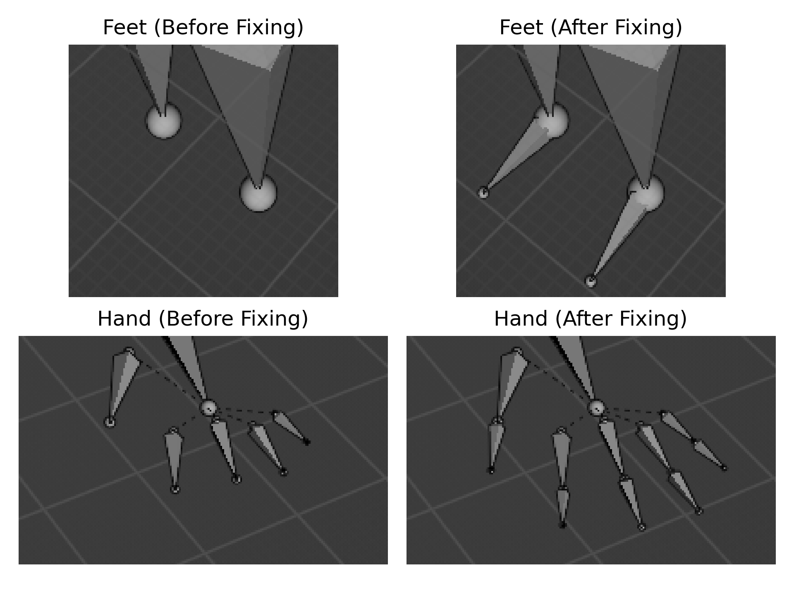

# Crowd Simulation with GANimator
In this project, GANimator is used to perform crowd simulation using only one motion sequence.
This project was done as the final project for "High Performance Computing for Data Science" course at the [University of Trento](https://www.unitn.it/en).

**For instructions on how to run the model, the original readme from the [GANimator](https://github.com/PeizhuoLi/ganimator) repository has been appended to the end this file**

## Fixing the End Sites Offset
<p align="center">
  
</p>
In all of the BVH files generated by GANimator, the offset of the end sites is set as zero in all three dimensions. This will result in end sites being in the exact same position as their parent joint, therefore, they are not visible. Since the generated BVH file has the exact same joints and initial positions as the training example, it is possible to transfer the correct end site offsets from the training example to the generated result. You can do this by running the `transfer_endsites.py` script in the `data` directory:
```bash
python transfer_endsites.py source.bvh target.bvh
```

## Generating a Crowd
First download the pre-trained weights from [here](https://drive.google.com/file/d/1AoCkh0P8-88dwpAIHgd8jJTqNKAayyce/view?usp=sharing). Extract the `zip` file and transfer the `Eight` directory to `pre-trained` directory in the root of the project. This directory contains the pre-trained weights for the `Eight` motion sequence available in the `data` directory. You can also train your own model using the instructions in the original readme.

After downloading the weights, you can generate a crowd by running the `demo.sh` script.
```bash
./demo.sh
```
This will generate 30 different motion sequences using the `Eight` pre-trained weights. The result is saved in `pre-trained/Eight` directory. You can visualize the generated BVH files using [Blender](https://www.blender.org).


# GANimator: Neural Motion Synthesis from a Single Sequence

  

This repository provides a library for novel motion synthesis from a single example, as well as applications including style transfer, motion mixing, key-frame editing and conditional generation. It is based on our work [GANimator: Neural Motion Synthesis from a Single Sequence](https://peizhuoli.github.io/ganimator/index.html) that is published in SIGGRAPH 2022.


## Prerequisites

This code has been tested under Ubuntu 20.04. Before starting, please configure your Anaconda environment by
~~~bash
conda env create -f environment.yaml
conda activate ganimator
~~~

In case you encounter a `GLIBCXX-3.4.29 not found` issue, please link your existing `libstdc++.so` file to the anaconda environment by `ln -sf /usr/lib/x86_64-linux-gnu/libstdc++.so.6  {path to anaconda}/envs/ganimator/bin/../lib/libstdc++.so.6`.

There is a [known bug](https://github.com/pytorch/pytorch/pull/69904) in the version of `pytorch` used in this project. If you encountered `AttributeError: module 'distutils' has no attribute 'version'`, downgrade your `setuptools` to version `59.5.0`.

Alternatively, you may install the following packages (and their dependencies) manually:

- pytorch == 1.10
- tensorboard >= 2.6.0
- tqdm >= 4.62.3
- scipy >= 1.7.3

## Quick Start

We provide several pretrained models for various characters. Download the pretrained model from [Google Drive](https://drive.google.com/file/d/1EnKE2B46sYWmRIdywNubJalzxzbvqvo-/view?usp=sharing). Please extract the downloaded file and put the `pre-trained` directory directly under the root of the ganimator directory. 

### Novel motion synthesis

Run `demo.sh`. The result for Salsa and Crab Dace will be saved in `./results/pre-trained/{name}/bvh`. The result after foot contact fix will be saved as `result_fixed.bvh`. You may visualize the generated bvh files with [Blender](https://www.blender.org).

Similarly, use command `python demo.py --save_path=./pre-trained/{name of pre-trained model}` will generate the result for the given pretrained model.


### Evaluation

A separate module for evaluation is *required*. Before starting with evaluation, please refer to the instruction of installation [here](https://github.com/PeizhuoLi/ganimator-eval-kernel).

Use the following command to evaluate a trained model:

~~~bash
python evaluate.py --save_path={path to trained model}
~~~

Particularly, `python evaluate.py --save_path=./pre-trained/gangnam-style` yields the quantitative result of our method with full approach reported in Table 1 and 2 of the paper.

## Train from scratch

We provide instructions for retraining our model.

We include several animations under `./data` directory.

Here is an example for training the crab dance animation:

~~~bash
python train.py --bvh_prefix=./data/Crabnew --bvh_name=Crab-dance-long --save_path={save_path}
~~~

You may specify training device by `--device=cuda:0` using pytorch's device convention.


For customized bvh file, specify the joint names that should be involved during the generation and the contact name in `./bvh/skeleton_databse.py`, and set corresponding `bvh_prefix` and `bvh_name` parameter for `train.py`.


### Training a Conditional Generator

A conditional generator takes the motion of one or several given joints as constraints and generate animation complying with the constraints. Before training a conditional generator, a regular generator must be trained on the same training sequence.

Here is an example for training a conditional generator for the walk-in-circle motion:

~~~bash
python train.py --bvh_prefix=./data/Joe --bvh_name=Walk-In-Circle --save_path={save_path} --skeleton_aware=1 --path_to_existing=./pre-trained/walk-in-circle --conditional_generator=1
~~~

This example assumes that a pre-trained regular generator is stored in `./pre-trained/walk-in-circle`, which is specified by the `--path_to_existing` parameter.

This repository contains the code using the motion of root joint as condition. However, it is also possible to customize the conditional joints. It can be done by modify the `get_layered_mask()` function in `models/utils.py`. It takes the `--conditional_mode` parameter as its first parameter and returns the corresponding channel indices in the tensor representation.

## Applications

### Motion Mixing

When trained with two or more sequences, our framework generates a mixed motion of the input animations.

This is an example for training on multiple sequences using `--multiple_sequence=1`:

~~~bash
python --bvh_prefix=./data/Elephant --bvh_name=list.txt --save_path={save_path} --multiple_sequence=1
~~~

The `list.txt` in `./data/Elephant` contains the names of the sequences to be trained.

We also provide a pre-trained model for the motion mixing of the elephant motions:


~~~bash
python demo.py --save_path=./pre-trained/elephant
~~~

### Key-frame Editing

Instead of generating the motion from random noise, we can perform key-frame editing by providing the edited key-frames in the coarsest level.

This is an example for keyframe editing:

~~~bash
python demo.py --save_path=./pre-trained/baseball-milling --keyframe_editing=./data/Joe/Baseball-Milling-Idle-edited-keyframes.bvh
~~~

The `--keyframe_editing` parameter points to the bvh file containing the edited key-frames, which should be as the same temporal resolution as the coarsest level. Note that in this specific example, the `--ratio` parameter for the model is set to `1/30`, leading to a sparser key-frame setting that makes editing easier.


### Style Transfer

Similarly, when the model is trained on *style* input and the coarsest level is given by the *content* input, our model can achieve style transfer.

This is an example for style transfer:

~~~bash
python demo.py --save_path=./pre-trained/proud-walk --style_transfer=./data/Xia/normal.bvh
~~~

Note the content of *content* input is required to be similar to the content of *style* input, in order to generate high-quality results as discussed in the paper.

### Conditional Generation

When a pre-defined motion of part of the skeleton (e.g., root trajectory) is given, a conditional generation model can produce animation complying with given constraints. 

This is an example for conditional generation:

~~~bash
python demo.py --save_path=./pre-trained/conditional-walk --conditional_generation=./data/Joe/traj-example.bvh
~~~

This pre-trained model takes the position and orientation of root joint from `traj-example.bvh`. If the conditional source file is not specified, the script will sample a trajectory from a pre-traiend regular generator as the condition. 

Additionally, `--interactive=1` option will generate the animation with interactive mode. In this mode, the condition information will be fed into the generator gradually. It is conceptually an interactive generation, but not an interactive demo that can be controlled with a keyboard or gamepad. 

For more details about specifying conditional joints, please refer to [Training a Conditional Generator](https://github.com/PeizhuoLi/ganimator#training-a-conditional-generator).

## Acknowledgements

The code in `models/skeleton.py` is adapted from [deep-motion-editing](https://github.com/DeepMotionEditing/deep-motion-editing) by [@kfiraberman](https://github.com/kfiraberman), [@PeizhuoLi](https://github.com/PeizhuoLi) and [@HalfSummer11](https://github.com/HalfSummer11).

Part of the code in `bvh` is adapted from the [work](https://theorangeduck.com/media/uploads/other_stuff/motionsynth_code.zip) of [Daniel Holden](https://theorangeduck.com/page/publications).

Part of the training examples is taken from [Mixamo](http://mixamo.com) and [Truebones](https://truebones.gumroad.com).


## Citation

If you use this code for your research, please cite our paper:

~~~bibtex
@article{li2022ganimator,
  author = {Li, Peizhuo and Aberman, Kfir and Zhang, Zihan and Hanocka, Rana and Sorkine-Hornung, Olga },
  title = {GANimator: Neural Motion Synthesis from a Single Sequence},
  journal = {ACM Transactions on Graphics (TOG)},
  volume = {41},
  number = {4},
  pages = {138},
  year = {2022},
  publisher = {ACM}
}
~~~
